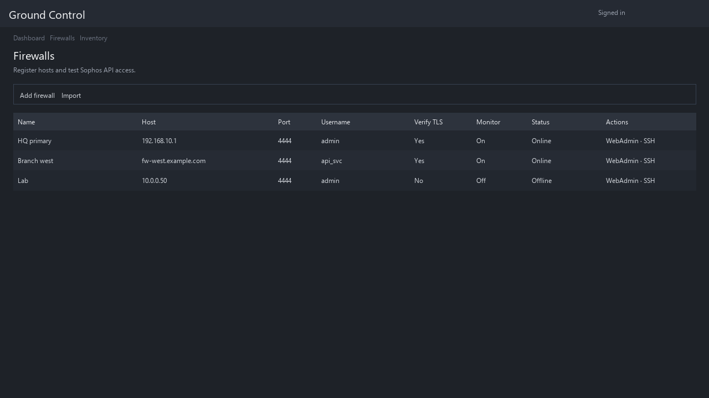

# Ground Control

**Ground Control** is an on-premises web application for managing **Sophos Firewalls**: register appliances, sync and inspect configuration, edit network and security objects through structured tables, queue changes, and open WebAdmin or SSH without leaving the browser.



*The figure above is a **representative** rendering of the Firewalls · Inventory table; you can overwrite `docs/images/firewalls-inventory.png` with a browser screenshot of `/firewalls` for a live capture.*

The **Firewalls · Inventory** view is where you add appliances (host, WebAdmin/API port, credentials), see online/offline status, last sync errors, and jump to monitoring, proxied WebAdmin, or the in-browser SSH terminal. A parallel **Configurations** tab covers virtual firewall definitions used for offline or template-style editing.

---

## Installation

### Prerequisites

- **Python 3.12+** (see `requires-python` in `pyproject.toml`).
- **[uv](https://github.com/astral-sh/uv)** (recommended) to install dependencies and run the app and tests. You can use `pip` instead if you install the project and its dev extras manually.
- **Git**, to clone the repository.
- **Native run (default):** no separate database server required; the app uses **SQLite** files under the repository root unless you set `GROUND_CONTROL_DATABASE_URL` (and related secrets DB URLs) to PostgreSQL or another SQLAlchemy-supported backend.
- **Docker Compose deployment:** **Docker** with Compose v2, and the secret files under `.gc_docker_secrets/` described in `docker-compose.yml` (PostgreSQL is provided as a service). See comments in `docker-compose.yml` for ports, networking, and troubleshooting reachability from the container to your LAN firewalls.

Optional: a **`.env`** file in the repo root for listen addresses, ports, database URLs, and other settings (loaded automatically from `app/config.py`).

### Clone from GitHub

```bash
git clone https://github.com/alantoewsio/ground-control.git
cd ground-control
```

### Install dependencies

```bash
uv sync
```

Include optional groups when needed (for example tray launcher or tests):

```bash
uv sync --group dev --group tray
```

### Launch the web application (native)

From the repository root:

```bash
uv run python main.py
```

Or:

```bash
uv run ground-control
```

Then open the URL shown in the log (by default **HTTP** on port **8000**, and **HTTPS** on **8443** when enabled in settings). On first visit you will be prompted to set an admin password.

---

## Ground Control Launcher (tray app)

The **launcher** is a small **system tray** application (Windows, macOS, Linux) that can start and stop Ground Control in **native** mode (runs `uv run python main.py` or `python main.py`) or manage the **Docker Compose** stack. It includes a dashboard (charts, console output), Docker secret editing, and optional start-at-login.

### Run the launcher on any OS

From the repository root, after syncing tray dependencies:

```bash
uv sync --group tray
uv run --group tray python scripts/gc_tray_wrapper.py
```

Close the dashboard window to minimize to the tray. On Windows/Linux (X11), hold **Ctrl** while clicking the window close control to quit the launcher entirely; on macOS, hold **Command**.

Keep **`launcher.exe`** (Windows build) or the script checkout **in the repository root** next to `main.py` so paths, `.env`, and data directories resolve correctly. For development you can set `GROUND_CONTROL_REPO_ROOT` to the repo path if needed.

### Build and run the Windows `.exe`

On **Windows**, with **uv** and the repo checked out:

```powershell
.\scripts\build_launcher.ps1
```

This syncs **tray** and **launcher-build** dependencies, refreshes launcher branding assets when possible, runs **PyInstaller** with `launcher.spec`, writes `dist\launcher.exe`, copies it to the repo root as `launcher.exe`, and starts that copy. Add `-Console` if you want a console window attached for debugging.

To run the app later, double-click **`launcher.exe`** in the repo root (or start it from the tray after it loads).

---

## Features

- **Dashboard** — Summary metrics and navigation into firewall-scoped work.
- **Firewalls · Inventory** — Register appliances (host, port, credentials, TLS verify, monitoring), tags and descriptions, **Configurations** (virtual firewalls) with member assignment, cache/sync indicators, batch delete, and apply-configuration workflows.
- **Per-appliance monitoring** — Reachability history and charts (`/firewalls/{id}/monitor`).
- **Proxied WebAdmin** — Open Sophos WebAdmin through Ground Control over HTTPS with access logging and optional auto-login using stored credentials.
- **Browser SSH** — Token-gated SSH session in the UI with diagnostics.
- **Address management / IPAM** — Prefixes, VRFs, next-assignment hints, interface pool commits, discovered networks, accept/batch-accept into IPAM, conflict awareness.
- **Firewalls · Network** — Unified **Interfaces** view (physical, VLAN, bridge pairs, LAGs), **Zones**, **Aliases**, **DHCP server** table-style management, facet filters and column picker patterns; **combined view** across selected firewalls with drift/compare where implemented.
- **Firewalls · Hosts & Services** — Table-driven editing for IP hosts, host groups, FQDN/MAC entities, and related objects, with combined multi-firewall mode and flyout editors aligned with network scope pickers.
- **Configurations** — Offline-style **Network** and **Hosts & Services** editing for virtual configurations, with APIs to apply entities (VLAN, zone, alias, LAG, bridge, IP host, etc.) to member firewalls.
- **Intrusion prevention** — IPS policy and related views, custom signatures, DoS/spoof helpers, trusted MAC, and configuration-oriented subpages as exposed in the UI.
- **Protect** — **Firewall** rule tables and **Web** filter policy workflows.
- **System** — **System services** (e.g. HA, NetFlow-related UI), **Administration** and **Profiles** surfaces tied to cached Sophos configuration.
- **Authentication** — Admin users/groups/profiles-style management pages backed by the secrets store and firewall cache where applicable.
- **History** — Access and activity history views for firewall operations.
- **Task queue** — Queue create/update operations, compare payloads, send to selected firewalls or all, embeddable task UI for docked workflows.
- **Settings** — Local **admin users**, **security** (TLS, self-signed generation, certificate download), **Let's Encrypt** (including DNS plugin credentials and test/queue), **data management** (history retention, orphan cleanup), **backup** (password, generate, download, restore), and **test firewalls** generation for development.
- **Background sync** — Scheduled/cache refresh of firewall configuration entities used by tables and flyouts.
- **Docker deployment** — `docker-compose.yml` for PostgreSQL + application container with secret-mounted configuration (see file header for operational notes).
- **Designer** (development) — Internal UI reference pages (`/designer/...`).

---

## Licensing

This project is licensed under the [Apache License 2.0](https://www.apache.org/licenses/LICENSE-2.0). See the [`LICENSE`](LICENSE) file in the repository root.

Third-party package licenses below are taken from installed distribution metadata (via [pip-licenses](https://pypi.org/project/pip-licenses/)) for the resolved trees: **runtime** (`uv export --no-dev`) and **development** (`uv export --only-group dev`). Versions reflect the lockfile at the time this section was generated. A few packages are not installed on every platform (for example `uvloop` on Windows); those rows cite [PyPI](https://pypi.org/) metadata instead.

### Runtime dependencies

| Package | Version | License |
| --- | --- | --- |
| acme | 5.5.0 | Apache-2.0 |
| annotated-doc | 0.0.4 | MIT |
| annotated-types | 0.7.0 | MIT License |
| anyio | 4.13.0 | MIT |
| APScheduler | 3.11.2 | MIT License |
| argon2-cffi | 25.1.0 | MIT |
| argon2-cffi-bindings | 25.1.0 | MIT |
| asyncssh | 2.22.0 | EPL-2.0 OR GPL-2.0-or-later |
| attrs | 26.1.0 | MIT |
| beautifulsoup4 | 4.14.3 | MIT License |
| boto3 | 1.42.85 | Apache-2.0 |
| botocore | 1.42.85 | Apache-2.0 |
| certbot | 5.5.0 | Apache-2.0 |
| certbot-dns-cloudflare | 5.5.0 | Apache-2.0 |
| certbot-dns-digitalocean | 5.5.0 | Apache-2.0 |
| certbot-dns-dnsimple | 5.5.0 | Apache-2.0 |
| certbot-dns-dnsmadeeasy | 5.5.0 | Apache-2.0 |
| certbot-dns-gehirn | 5.5.0 | Apache-2.0 |
| certbot-dns-google | 5.5.0 | Apache-2.0 |
| certbot-dns-linode | 5.5.0 | Apache-2.0 |
| certbot-dns-luadns | 5.5.0 | Apache-2.0 |
| certbot-dns-nsone | 5.5.0 | Apache-2.0 |
| certbot-dns-ovh | 5.5.0 | Apache-2.0 |
| certbot-dns-rfc2136 | 5.5.0 | Apache-2.0 |
| certbot-dns-route53 | 5.5.0 | Apache-2.0 |
| certbot-dns-sakuracloud | 5.5.0 | Apache-2.0 |
| certifi | 2026.2.25 | Mozilla Public License 2.0 (MPL 2.0) |
| cffi | 2.0.0 | MIT |
| charset-normalizer | 3.4.6 | MIT |
| click | 8.3.1 | BSD-3-Clause |
| cloudflare | 2.19.4 | MIT License |
| colorama | 0.4.6 | BSD License |
| ConfigArgParse | 1.7.5 | MIT License |
| configobj | 5.0.9 | BSD License |
| cryptography | 46.0.6 | Apache-2.0 OR BSD-3-Clause |
| distro | 1.9.0 | Apache Software License |
| dns-lexicon | 3.23.2 | MIT |
| dnspython | 2.8.0 | ISC License (ISCL) |
| fastapi | 0.135.2 | MIT |
| filelock | 3.25.2 | MIT |
| google-api-core | 2.30.2 | Apache Software License |
| google-api-python-client | 2.193.0 | Apache Software License |
| google-auth | 2.49.1 | Apache Software License |
| google-auth-httplib2 | 0.3.1 | Apache Software License |
| googleapis-common-protos | 1.74.0 | Apache Software License |
| greenlet | 3.3.2 | MIT AND PSF-2.0 |
| h11 | 0.16.0 | MIT License |
| httpcore | 1.0.9 | BSD-3-Clause |
| httplib2 | 0.31.2 | MIT License |
| httptools | 0.7.1 | MIT |
| httpx | 0.28.1 | BSD License |
| idna | 3.11 | BSD-3-Clause |
| itsdangerous | 2.2.0 | BSD License |
| Jinja2 | 3.1.6 | BSD License |
| jmespath | 1.1.0 | MIT License |
| josepy | 2.2.0 | Apache-2.0 |
| jsonlines | 4.0.0 | BSD License |
| jsonpickle | 4.1.1 | BSD-3-Clause |
| MarkupSafe | 3.0.3 | BSD-3-Clause |
| parsedatetime | 2.6 | Apache Software License |
| proto-plus | 1.27.2 | Apache Software License |
| protobuf | 7.34.1 | 3-Clause BSD License |
| psycopg | 3.3.3 | LGPL-3.0-only |
| psycopg-binary | 3.3.3 | LGPL-3.0-only |
| pyasn1 | 0.6.3 | BSD-2-Clause |
| pyasn1_modules | 0.4.2 | BSD License |
| pycparser | 3.0 | BSD-3-Clause |
| pydantic | 2.12.5 | MIT |
| pydantic_core | 2.41.5 | MIT |
| pyOpenSSL | 26.0.0 | Apache Software License |
| pyotp | 2.9.0 | MIT License |
| pyparsing | 3.3.2 | MIT |
| pyRFC3339 | 2.1.0 | MIT |
| python-dateutil | 2.9.0.post0 | Apache Software License; BSD License |
| python-digitalocean | 1.17.0 | LGPL v3 |
| python-dotenv | 1.2.2 | BSD-3-Clause |
| python-multipart | 0.0.22 | Apache-2.0 |
| pywin32 | 311 | Python Software Foundation License |
| PyYAML | 6.0.3 | MIT License |
| requests | 2.33.0 | Apache Software License |
| requests-file | 3.0.1 | Apache Software License |
| s3transfer | 0.16.0 | Apache Software License |
| six | 1.17.0 | MIT License |
| sophosfirewall-python | 0.1.66 | UNKNOWN |
| soupsieve | 2.8.3 | MIT |
| SQLAlchemy | 2.0.48 | MIT |
| starlette | 1.0.0 | BSD-3-Clause |
| tldextract | 5.3.1 | BSD-3-Clause |
| typing_extensions | 4.15.0 | PSF-2.0 |
| typing-inspection | 0.4.2 | MIT |
| tzdata | 2025.3 | Apache-2.0 |
| tzlocal | 5.3.1 | MIT License |
| uritemplate | 4.2.0 | BSD 3-Clause OR Apache-2.0 |
| urllib3 | 2.6.3 | MIT |
| uvicorn | 0.42.0 | BSD-3-Clause |
| uvloop | 0.22.1 | MIT License (from PyPI; optional uvicorn extra, not installed on Windows) |
| watchfiles | 1.1.1 | MIT License |
| websockets | 16.0 | BSD-3-Clause |
| xmltodict | 0.13.0 | MIT License |

### Development dependencies

| Package | Version | License |
| --- | --- | --- |
| colorama | 0.4.6 | BSD License |
| coverage | 7.13.5 | Apache-2.0 |
| iniconfig | 2.3.0 | MIT |
| libcst | 1.8.6 | MIT License |
| packaging | 26.0 | Apache-2.0 OR BSD-2-Clause |
| pluggy | 1.6.0 | MIT License |
| Pygments | 2.20.0 | BSD-2-Clause |
| pytest | 9.0.2 | MIT |
| pytest-asyncio | 1.3.0 | Apache-2.0 |
| pytest-cov | 7.1.0 | MIT |
| PyYAML | 6.0.3 | MIT License |
| pyyaml-ft | 8.0.0 | MIT License (from PyPI) |
| typing_extensions | 4.15.0 | PSF-2.0 |
