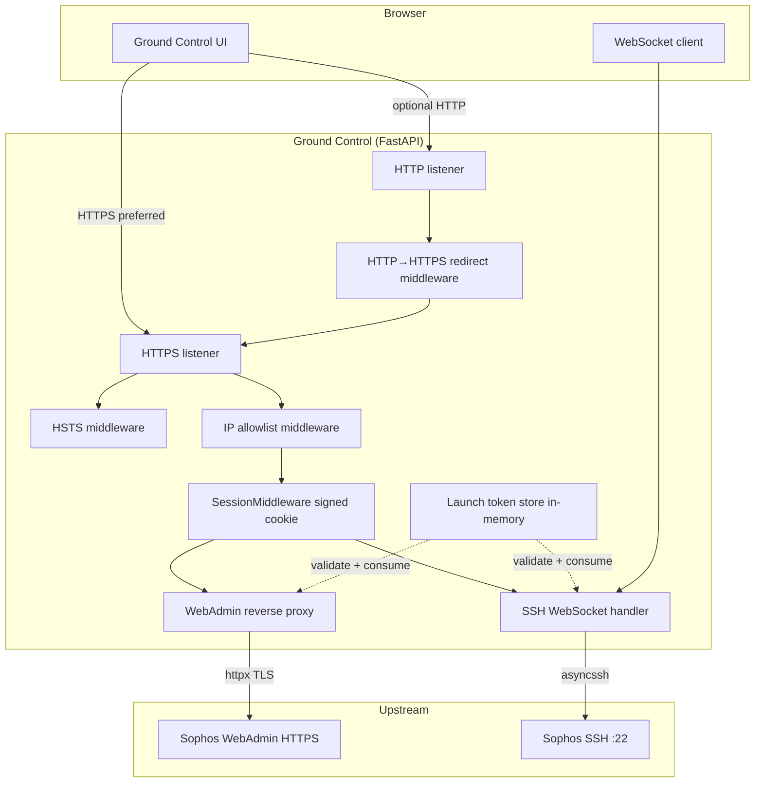
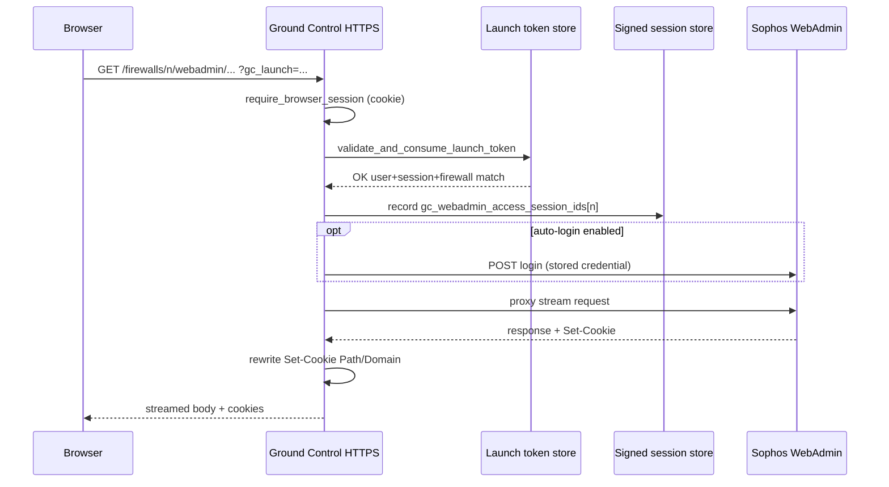

# Ground Control — HTTPS, WebAdmin proxy, and browser SSH (session bridging)

This document describes the **secure access path** for administrators: TLS termination, HTTP→HTTPS behavior, the **reverse-proxied Sophos WebAdmin** experience, and **browser SSH** over WebSockets. It also catalogs **security hardening** implemented in code.

**Scope note — “SSO” in this app:** Ground Control does not implement SAML/OAuth enterprise single sign-on. Instead it provides **session-bridging**: a signed **browser session** (cookie) plus **short-lived, single-use launch tokens** (`gc_launch`) so that only an authenticated user who explicitly opens WebAdmin or SSH from the UI receives a constrained capability to reach those services. Optional **WebAdmin auto-login** reuses the **same stored credential** as the XML API (see risks below).

---

## 1. High-level architecture

**Primary modules**

| Concern | Module(s) |
|--------|-----------|
| TLS state, cert paths, self-signed generation | `app/security_settings.py` |
| HTTP→HTTPS redirect | `app/main.py` (`_gc_redirect_http_to_https`, `security_settings.https_redirect_url_if_applicable`) |
| HSTS | `app/main.py` (`_gc_hsts_header`) |
| Client IP allowlist | `app/main.py` (`_gc_allowed_ranges_guard`, `_request_allowed_by_ranges`) |
| Session cookie & idle timeout | `app/main.py` + `app/auth.py` |
| Same-origin / HTTPS session detection behind proxies | `app/url_helpers.py` |
| Launch tokens | `app/access_launch_tokens.py` |
| WebAdmin proxy + cookie/HTML/JS rewrite | `app/webadmin_proxy.py`, `app/webadmin_proxy_rewrite.py` |
| Leaked WebAdmin path recovery | `app/webadmin_leak_redirect.py` |
| Per-firewall WebAdmin “session” in server session | `app/access_history.py` |
| SSH WebSocket bridge | `app/firewall_ssh.py`, `app/main.py` (routes) |
| Diagnostic echo WebSocket | `app/browser_ws_echo.py` |

---

## 2. HTTPS and transport security

### 2.1 Dual listeners and shared application

The process can bind **HTTP** and **HTTPS** concurrently (two uvicorn servers, one FastAPI app). TLS material is loaded only on the HTTPS listener (`app/main.py` → `_serve()`).

### 2.2 Persisted security UI state

`SecurityUiState` in `app/security_settings.py` (file `.gc_security_state.json`) controls:

- Whether HTTP and/or HTTPS is enabled, ports, and listen interface mapping.
- **Redirect HTTP to HTTPS** when both are enabled (with an exception for `/.well-known/acme-challenge/` for ACME HTTP-01).
- **Allowed client IP ranges** (CIDR list) enforced globally for HTTP requests (see §3).
- **TLS hostname** used when building redirect targets and self-signed certificate SAN.

Runtime port defaults can still come from environment (`GROUND_CONTROL_HTTP_PORT`, `GROUND_CONTROL_HTTPS_PORT`, etc.) via `app/config.py`; the saved UI state drives what the running server actually binds after first load.

### 2.3 TLS certificates

- Default paths: `.gc_tls/cert.pem` and `.gc_tls/key.pem`, overridable with `GROUND_CONTROL_TLS_CERT_PATH` / `GROUND_CONTROL_TLS_KEY_PATH`.
- If HTTPS is enabled and no certificate is present, startup attempts **auto-generation** of a **self-signed** cert (`generate_self_signed_certificate`): RSA **2048**-bit, **SHA-256**, subject CN + **Subject Alternative Name (DNS)** for the configured hostname, ~825-day validity (`ensure_tls_certificate_if_https_enabled`).
- Public cert PEM is exposed for download at a settings API route for trust-store installation (admin flow).

### 2.4 HTTP→HTTPS redirect

Middleware `_gc_redirect_http_to_https` calls `https_redirect_url_if_applicable`, which **does not redirect** WebSocket upgrade requests on HTTP (avoids breaking WS that expect to stay on the HTTP port in split-port setups).

### 2.5 Strict-Transport-Security

For responses where `request_is_https_session` is true, middleware adds:

`Strict-Transport-Security: max-age=31536000; includeSubDomains`

### 2.6 Trusted reverse proxies

`request_is_https_session` and `request_origin` honor `X-Forwarded-Proto` / `X-Forwarded-Host` **only** when the immediate TCP client is inside **`GROUND_CONTROL_TRUSTED_PROXY_RANGES`** (default `127.0.0.1/32,::1/128`). This reduces **header spoofing** when the app is not behind a trusted proxy.

---

## 3. Global IP allowlist

When **allowed_ranges** in security settings is non-empty, `_gc_allowed_ranges_guard` returns **403** for requests whose **direct** client IP (from ASGI scope) is not in any configured network. The same check wraps:

- WebSocket endpoints for **browser echo** and **firewall SSH** (close code **4403** if blocked).

Empty allowlist means **no restriction** (fail-open for compatibility).

---

## 4. Browser session (authentication to Ground Control)

### 4.1 Session middleware

`SessionMiddleware` (`app/main.py`):

- **Secret**: `GROUND_CONTROL_SESSION_SECRET` or `.session_secret` file (auto-created with `secrets.token_hex(32)`, chmod `0o600` where supported).
- **Max age**: 14 days.
- **SameSite**: `lax` (CSRF mitigation for cross-site cookie submission on navigations).
- **Secure flag**: `https_only=config.secure_session_cookie_enabled()` — disabled under pytest and overridable via `GROUND_CONTROL_SECURE_SESSION_COOKIE`.

### 4.2 Password storage (app users)

`app/auth.py` uses **Argon2id** (`argon2-cffi`) with explicit cost parameters. `validate_new_password` enforces minimum length (10) and maximum (256).

### 4.3 Idle timeout

`evaluate_session_idle` clears the session after `GROUND_CONTROL_SESSION_IDLE_MINUTES` without activity (0 disables). API middleware and `require_browser_json_session` return **401** with an explicit “session expired” message when idle.

### 4.4 API protection middleware

`ProtectApiMiddleware` (`app/main.py`) requires a valid, non-idle session for `/api/*` except documented public auth routes, and touches activity on each request.

---

## 5. WebAdmin reverse proxy (HTTPS session path)

### 5.1 When the proxy is used

`webadmin_entry_url` (`app/url_helpers.py`): if the user’s **browser-facing session is HTTPS**, links point under `/firewalls/{id}/webadmin/...`. If the session is plain HTTP, the UI links **directly** to the appliance (`https://host:port/`), bypassing the proxy—so TLS to the firewall is still used, but **not** tunneled through Ground Control.

### 5.2 Route protection

`firewall_webadmin_proxy` (`app/main.py`):

1. **`require_browser_session`** — must be signed in to Ground Control.
2. If not HTTPS session → **302** redirect to direct appliance URL (defense in depth: proxy logic assumes GC HTTPS).
3. **Mutating requests** (`POST`, `PUT`, `PATCH`, `DELETE`): **`Origin` / `Referer` same-origin check** (`_is_same_origin_browser_request`) → **403** on cross-origin proxy abuse.
4. **Per-firewall WebAdmin session gate**: unless the signed session already has a **WebAdmin access session id** for that firewall (`access_history.has_webadmin_session_id`), only the **entry** GET path is allowed; other paths return **403** (“Launch WebAdmin from the Firewalls page.”).

### 5.3 Launch token (`gc_launch`) for WebAdmin entry

On first entry, the query param **`gc_launch`** must validate via `validate_and_consume_launch_token`:

- Token is **cryptographically random** (`secrets.token_urlsafe(24)`), stored in memory with **TTL** (default **90s**).
- **Single-use**: removed from the store on validation.
- Binds **`user_id`**, **`session_tracking_id`** (per-browser-session token in signed session), **`firewall_id`**, and **`access_type`** (`webadmin`).
- **Session match required** — prevents replay from another browser or after sign-out.

Issuance happens only after authenticated actions in the UI (e.g. “open WebAdmin”).

### 5.4 Optional auto-login to Sophos WebAdmin

On entry GET, if an **encrypted API password** exists in the secrets DB, the server may perform **`try_auto_login_webadmin`** so the user lands in WebAdmin without the appliance login form. This is a **convenience feature** with a **security trade-off**: the same secret used for XML API management is used for WebAdmin login automation.

### 5.5 Upstream proxy hardening (`webadmin_proxy.py`)

- **Hop-by-hop headers** stripped; **`Host`** set to the appliance’s expected value; **`Accept-Encoding: identity`** to simplify streaming body handling.
- **`Set-Cookie` rewriting**: **strip `Domain=`** (avoid domain-wide cookies on the GC host); **prefix `Path=`** so appliance cookies apply under `/firewalls/{id}/webadmin/...`.
- **Response rewriting** (HTML/CSS/JS) to fix absolute paths for assets and navigation under the proxy (`webadmin_proxy_rewrite.py`), with size limits (`MAX_REWRITE_BODY_BYTES`) to bound work and memory.

### 5.6 Leaked-path middleware

`WebadminLeakedPathRedirectMiddleware` (`webadmin_leak_redirect.py`): if Sophos client-side code navigates to `/webconsole/...` **on the Ground Control origin** (leaking out of the proxy prefix), and **Referer** indicates a recent proxied session, the user is **307** redirected back under `/firewalls/{id}/webadmin/...`. Same **host** is required on Referer to avoid open redirects.

### 5.7 Audit logging

`access_history.create_access_log` records WebAdmin **start** (auto-login, proxied-login) and **end** (logout) with user id, username, client IP, and a per-launch **session id** stored in the signed server session (`gc_webadmin_access_session_ids`).

---

## 6. Browser SSH (WebSocket) and launch tokens

### 6.1 Page load (`/firewalls/{id}/ssh`)

- Requires **`require_browser_session`**.
- Consumes a **`gc_launch`** token with **`access_type=ssh_page`** and **full session match** (same as WebAdmin entry).

### 6.2 WebSocket path (`/firewalls/{id}/ssh/ws`)

**Pre-handler** (`app/main.py`):

1. **IP allowlist** (if configured).
2. **`validate_and_consume_launch_token`** with **`access_type=ssh_ws`** and **`require_session_match=False`**.

The token is still **single-use** and **time-bounded**, but the WebSocket upgrade path does not re-check user id / session tracking id in this step—**session and origin are enforced inside** `firewall_ssh_terminal_ws`.

**`api_firewall_ssh_ws_launch`** (POST): requires **`require_browser_json_session`** and **same-origin** headers; issues a fresh **`ssh_ws`** token for the client to open the socket.

### 6.3 `firewall_ssh_terminal_ws` (`app/firewall_ssh.py`)

After the launch token gate:

1. **`browser_websocket_origin_error`**: **`Origin` required**; scheme/host must match **`request_origin`**; if the Ground Control page is HTTPS, **Origin must be `https:`** (blocks mixed-content downgrade).
2. **`websocket.accept()`**
3. **`browser_websocket_session_error`**: same checks as echo WS — signed-in user with password, not idle; otherwise JSON error + close **4001**.
4. Connects **AsyncSSH** to inventory **host** and **username**; **password auth remains primarily interactive** in the terminal, with optional use of **decrypted saved API password** for keyboard-interactive flows when available.
5. **Access history** events for connect/disconnect with actor and client IP.

### 6.4 Diagnostic echo WebSocket (`/api/browser-ws-echo/ws`)

Authenticated **origin + session** checks **before** accept (unlike SSH which accepts then sends error—implementation detail). Used for connectivity diagnostics only; no SSH.

---

## 7. Security hardening summary

The following measures are **implemented in this codebase** (not merely recommended):

| Category | Measure |
|----------|---------|
| **TLS** | Optional dual-stack HTTP/HTTPS; configurable cert paths; self-signed generation with modern algorithm/key size; certificate metadata API for trust onboarding. |
| **Transport policy** | Optional forced HTTP→HTTPS redirect; **HSTS** on HTTPS responses; **ACME** path exempt from redirect. |
| **Session cookie** | Signed cookie (`itsdangerous` via Starlette); **SameSite=Lax**; **Secure** on HTTPS when enabled; 14-day max age; idle timeout with server-side clearing. |
| **Secrets** | Session secret from env or file; Fernet key for firewall passwords separate file/env; `.session_secret` chmod `0o600` best-effort. |
| **Passwords** | Argon2id for app users; minimum length enforcement. |
| **API surface** | Middleware auth on `/api/*` with explicit public exceptions; JSON 401 for XHR vs redirect for pages. |
| **CSRF / cross-origin** | WebAdmin proxy mutating requests require same **Origin** or **Referer** as the app. |
| **WebSocket** | **Origin** header required and must match computed app origin; **HTTPS pages cannot use `http:` Origin**; session validity and idle rules aligned with HTTP API. |
| **Capability tokens** | Short TTL, single-use, bound to user + session tracking + target firewall + access kind for WebAdmin and SSH page entry; SSH WS token single-use (session re-verified in handler). |
| **Network** | Optional global **CIDR allowlist** for all HTTP and selected WebSockets. |
| **Reverse proxy safety** | Forwarded HTTPS detection gated on **trusted proxy CIDRs** only. |
| **WebAdmin isolation** | Appliance cookies scoped by **path rewrite**; **Domain** stripped; streaming proxy with bounded rewrite size. |
| **UX security** | Leaked-path middleware re-hooks Sophos root paths back under the proxy prefix when Referer proves context. |
| **Audit** | `AccessSessionLog` rows for WebAdmin (and SSH) lifecycle with user and client IP. |

---

## 8. Residual risks and operational guidance

1. **Stored firewall password**: One credential (encrypted at rest) may unlock **XML API**, **optional WebAdmin auto-login**, and **SSH keyboard-interactive assist**. Compromise of Ground Control secrets DB + Fernet key is high impact—protect filesystem backups and key files accordingly.
2. **SSH WS launch token without session match on upgrade**: The token is still **unpredictable** and **one-time**, but anyone who captures the **full WS URL within TTL** could consume it once. Prefer **HTTPS**, short token TTL, and network controls. Session is **re-validated** immediately after accept.
3. **IP allowlist vs reverse proxies**: Allowlist uses the **immediate** client IP; if GC sits behind a load balancer without source IP preservation, configure networks carefully or terminate TLS at GC with correct `Forwarded` trust.
4. **Self-signed TLS**: Browsers will warn unless the admin installs the CA/cert; use enterprise PKI or Let’s Encrypt in production where possible.
5. **SameSite=Lax**: Does not block all CSRF vectors for top-level navigations; the proxy adds **Origin checks** on state-changing methods for defense in depth.

---

## 9. Mermaid — WebAdmin first request (simplified)

---

## 10. Revision history

| Date | Change |
|------|--------|
| 2026-04-08 | Initial document for HTTPS, WebAdmin proxy, browser SSH, launch tokens, and hardening inventory. |

When behavior changes, update this file and cross-link from `design/ARCHITECTURE.md` if the high-level overview should reference it.
