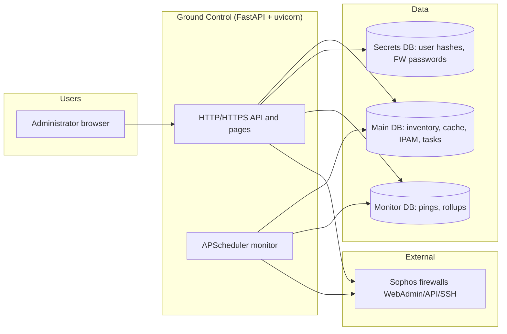
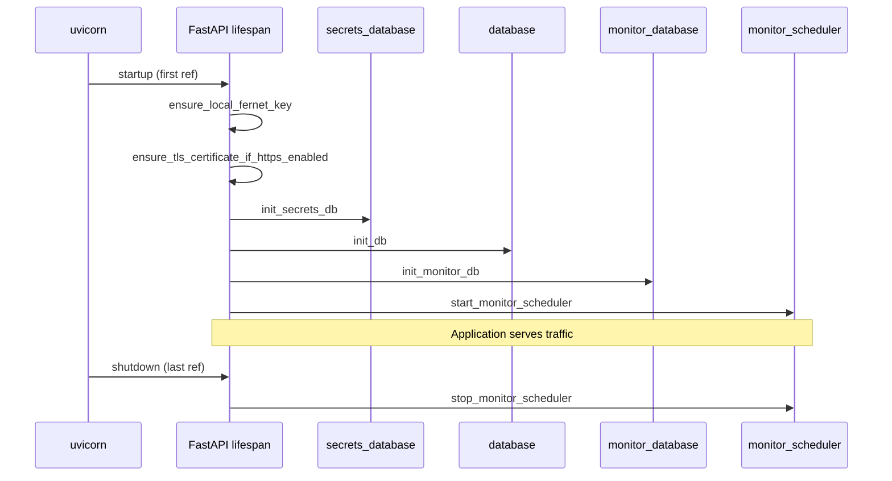
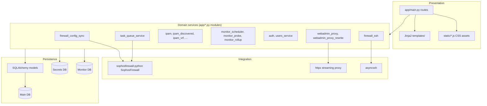
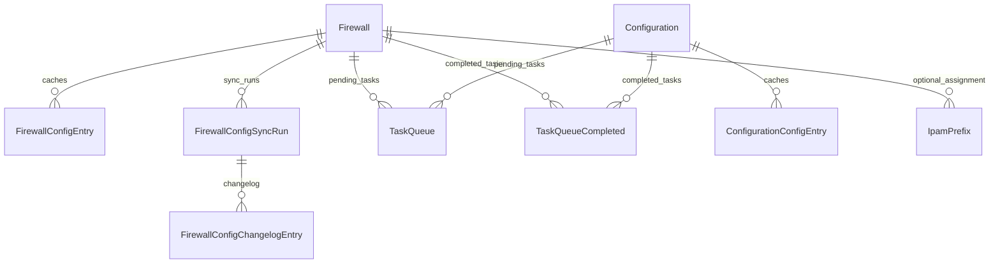
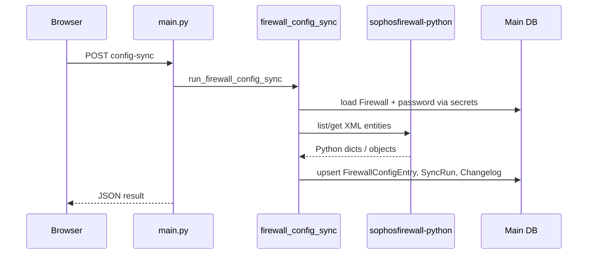
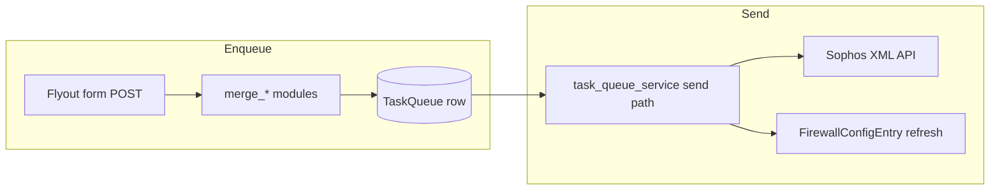

# Ground Control — System Architecture

This document describes how **Ground Control** is structured: what it talks to, how requests flow, where data lives, and how major features are implemented in this repository (Python **FastAPI** backend, **Jinja2** HTML, **vanilla JavaScript** in `static/`, **SQLAlchemy** persistence).

---

## 1. Purpose and scope

Ground Control is a web application for managing **Sophos firewall** devices at scale: inventory, cached configuration views, optional **virtual configurations** (design-time targets), a **task queue** that pushes changes via the Sophos XML API, **IP address management** (IPAM), **connectivity monitoring**, embedded **WebAdmin** access and **browser SSH**, and operational dashboards.

---

## 2. System context

Administrators use a browser. The app binds HTTP and/or HTTPS (configurable in security settings), stores operational data in SQLite (or other SQLAlchemy URLs), and reaches firewalls over the network for API sync, task application, TCP probes, reverse-proxied WebAdmin, and SSH.

**Implementation notes**

- Entry point: `main.py` delegates to `app.main:main`.
- `app.main` constructs the FastAPI app, registers routes, mounts `StaticFiles` for `static/`, and can run **one or two** uvicorn servers (HTTP and HTTPS) with shared app state; see `lifespan` and `_serve()`.
- Environment-driven URLs: `GROUND_CONTROL_DATABASE_URL`, `GROUND_CONTROL_SECRETS_DATABASE_URL`, `GROUND_CONTROL_MONITOR_DATABASE_URL` (`app/config.py`).

---

## 3. Process and startup lifecycle

On first startup of the shared app (ref-counted when both HTTP and HTTPS listeners run), the lifespan hook:

1. Ensures a local Fernet key file if none is configured (for encrypting firewall passwords).
2. Ensures TLS material if HTTPS is enabled (`app/security_settings.py`).
3. Initializes the secrets database and runs any legacy migration from the main SQLite file (`app/secrets_database.py`).
4. Initializes the main database schema and SQLite migrations (`app/database.py` → `init_db`).
5. Initializes the monitor database (`app/monitor_database.py` → `init_monitor_db`).
6. Starts the **monitor scheduler** (`app/monitor_scheduler.py` → `start_monitor_scheduler`).

On last shutdown, the monitor scheduler stops.

---

## 4. Layered architecture inside the app

**Conventions**

- **Fat `app/main.py`**: most HTTP routes, dependency injection, and HTML page wiring live here; domain logic is pushed into focused modules (`firewall_config_sync.py`, `task_queue_service.py`, `interface_table.py`, etc.).
- **Table builders**: modules such as `interface_table.py`, `hosts_services_table.py`, `firewall_rule_table.py`, `ips_policy_table.py` turn ORM-backed cache rows into JSON payloads for the UI.
- **Merge modules** (`*_merge.py`, `*_flyout_merge.py`): normalize multi-firewall or multi-scope form posts into a single payload shape before enqueue or apply (combined views, configurations).

---

## 5. Data stores

### 5.1 Three databases

| Store | Default file / env | Role |
|--------|-------------------|------|
| Main | `ground_control.db` | Firewalls, cached config entries, configurations, task queue, IPAM, access logs, changelog, reference data |
| Secrets | `ground_control_secrets.db` | `AppUser` password hashes, `FirewallCredential` (Fernet-encrypted API password per firewall id) |
| Monitor | `ground_control_monitor.db` | Raw `FirewallWebadminPing` samples and `FirewallConnectivityRollup` aggregates |

SQLite connections enable WAL mode and foreign keys (`app/db_utils.py`, engine `connect` listeners).

### 5.2 Main schema (conceptual ERD)

`IpamVrf` is a separate lookup table for named VRFs; `IpamPrefix` stores VRF as string fields (`vrf`, `vrf_bucket`) rather than a foreign key.

Representative models live in `app/models.py` (`Firewall`, `FirewallConfigEntry`, `TaskQueue`, `Configuration`, `IpamPrefix`, …). Secrets and monitor tables use separate declarative bases in `app/secrets_models.py` and `app/monitor_models.py`.

---

## 6. Firewalls and configuration cache

### 6.1 Firewall record

`Firewall` stores connection metadata (host, WebAdmin port, username, SSL verify, per-firewall API timeout, tags, test flag, monitor interval). **API passwords** are not on this row; they are loaded from the secrets DB by firewall id.

### 6.2 Config sync

`app/firewall_config_sync.py` defines a **catalog** of entity types (interfaces, VLANs, zones, hosts, IPS, web filter, rules, users, etc.). Each type maps to a **fetch** function on `SophosFirewall` from **sophosfirewall-python**. Sync:

- Optionally checks connectivity (`firewall_connectivity.firewall_is_online`).
- Decrypts the stored password, constructs `SophosFirewall`, patches HTTP timeouts (`firewall_api_client.patch_sophos_firewall_request_timeout`).
- Fetches entities, serializes payloads to JSON, upserts `FirewallConfigEntry` rows, records `FirewallConfigSyncRun` and per-object `FirewallConfigChangelogEntry`.
- Can refresh reference data (e.g. countries via `ref_countries`).

Triggered from API routes (e.g. `/api/firewalls/{id}/config-sync`) and from task-queue flows when reconciliation is needed.

### 6.3 Configurations (virtual firewalls)

`Configuration` rows represent **editable local caches** without a live device. Member firewalls are expressed as JSON (`member_firewall_ids_json`: explicit ids plus tag-based membership). Cached entities live in `ConfigurationConfigEntry`, analogous to `FirewallConfigEntry`.

Apply paths (`app/configuration_config_apply.py`) merge UI form data and either update the configuration cache directly or enqueue `TaskQueue` rows for later push to real firewalls—reusing the same entity-type constants as firewall sync.

---

## 7. Task queue and outbound changes

### 7.1 Purpose

`TaskQueue` holds **pending** changes (entity type, external name, JSON payload, scope = firewall and/or configuration). Successful pushes move to `TaskQueueCompleted` for audit.

### 7.2 Implementation

`app/task_queue_service.py` is the core orchestrator:

- **Enqueue**: validates merges from network/HS/IPS/web filter/auth flyouts, persists rows, coordinates with configuration cache updates where applicable.
- **Send**: loads credentials, builds `SophosFirewall`, maps entity type to update/create/delete operations (often via **xmltodict** and library helpers), handles errors and post-success sync refreshes (`run_firewall_config_sync` for affected types).
- **Compare**: server-side diff (e.g. `difflib`) for UI review.

Routes under `/api/task-queue/*` expose list, enqueue per entity family, send, delete, and compare. The UI uses `static/task-queue.js`, `task-queue-dock.js`, and templates `task_queue.html` / embed variants.

---

## 8. IP address management (IPAM)

Implemented primarily in `app/ipam.py`, `ipam_discovered.py`, `ipam_conflicts.py`, `ipam_vrf.py`, `ipam_interface_pool.py`, `interface_ipam_hints.py`, and `interface_combine_ipam.py`.

- **Prefixes** (`IpamPrefix`): CIDR, VRF bucket, assignment vs pool, optional link to a firewall or free-text assignment.
- **VRFs** (`IpamVrf`): named VRFs for suggestions and consistency.
- **Discovery**: inferred assignments from synced interface data; user **accept** flows write or reconcile prefixes.
- **UI/API**: pages under `/address-management`, JSON under `/api/ipam/*`; static `gc-ipam.js`.

---

## 9. Monitoring

- **Scheduler**: `BackgroundScheduler` (APScheduler) in `monitor_scheduler.py` runs cron-style rollups and a periodic worker that selects firewalls due for probe (per `monitor_interval_minutes`, skipping staggered overlap).
- **Probe**: `monitor_probe.tcp_connect_ms` opens a TCP connection to the firewall WebAdmin host/port; results stored in `FirewallWebadminPing`.
- **Rollups**: `monitor_rollup.py` aggregates hourly/daily statistics into `FirewallConnectivityRollup` for long-range charts.
- **UI**: `firewall_monitor.html` and related API routes for history and dashboard widgets.

`firewall_connectivity.firewall_is_online` combines recent probe state for quick checks elsewhere in the app.

---

## 10. Authentication, sessions, and users

- **Sessions**: Starlette `SessionMiddleware` with signed cookies (`app/auth.py`, secret from file or `GROUND_CONTROL_SESSION_SECRET`). Idle timeout via `GROUND_CONTROL_SESSION_IDLE_MINUTES` and `/api/auth/activity`.
- **Users**: `users_service` + `AppUser` in secrets DB; Argon2 password hashing (`hash_password` / `verify_password`). Admin setup and user CRUD under `/api/settings/users`.
- **Authorization**: Dependencies such as `require_authenticated_user_id`, `require_admin_user_id`, `require_browser_json_session` guard API and page routes.
- **Launch tokens**: `access_launch_tokens.py` supports one-time query-param tokens for controlled entry points.

---

## 11. WebAdmin proxy and browser SSH

### 11.1 WebAdmin proxy

When the app is served over HTTPS, firewall WebAdmin can be reached through a **reverse proxy** (`webadmin_proxy.py`) using **httpx** streaming. Responses may be rewritten (`webadmin_proxy_rewrite.py`) so paths, scripts, and CSS work under the proxy prefix. Access is tied to session auth; `access_history.py` records session lifecycle. `webadmin_leak_redirect.py` helps avoid accidental navigation to raw firewall URLs.

### 11.2 SSH

`firewall_ssh.py` exposes a **WebSocket** (`/firewalls/{id}/ssh/ws`) that bridges the browser to **asyncssh** against the firewall (keyboard-interactive login path). Device info refresh may call `firewall_webadmin_info`.

---

## 12. Dashboard and metrics

`dashboard_metrics.py` aggregates inventory counts, connectivity snapshots, and related fields into a single JSON payload for `dashboard.js` and `/api/dashboard`. `parse_firewall_ids_query` supports filtered views.

---

## 13. Background activity banner

`background_activity.py` holds an in-memory, per-user counter and message for long operations (config sync, task queue sends). The UI polls `/api/background-sync-status` to restore banners after navigation.

---

## 14. Frontend architecture

- **Server-rendered shell**: `templates/base.html`, section bases (`firewalls_base.html`, `configurations_base.html`, …).
- **Progressive enhancement**: page-specific scripts in `static/` (e.g. `gc-table-facets.js`, `gc-network-entity.js`, `gc-hosts-services-flyout.js`, `dashboard.js`, `auth-app.js`).
- **Patterns**: combined multi-firewall tables merge rows client-side with server-provided payloads; flyouts post to internal or `/api/...` endpoints; task queue dock embeds on multiple pages.

No bundler is required for production; the browser loads discrete JS files referenced from templates.

---

## 15. Security and crypto

- **Fernet** (`app/crypto.py`, key from env or `.fernet_key`) encrypts firewall passwords at rest in the secrets database.
- **TLS**: optional self-signed generation and certificate download endpoints under settings.
- **IP allowlists**: middleware in `main.py` can restrict access by client network (`_parse_allowed_ip_networks`).
- **WebSocket origin checks**: `browser_websocket_origin_error` and related helpers reduce CSRF-style issues for WS endpoints.

---

## 16. Testing and quality

- **pytest** suite under `tests/` covers sync, task queue logic, proxy rewriting, auth, IPAM, and many API behaviors.
- **Coverage** configuration in `pyproject.toml` (`tool.coverage`).

---

## 17. Key file index

| Area | Primary modules |
|------|-----------------|
| App entry & routes | `app/main.py`, `main.py` |
| Config / env | `app/config.py` |
| Main ORM | `app/models.py` |
| DB init / migrations | `app/database.py`, `app/db_utils.py` |
| Secrets ORM / DB | `app/secrets_models.py`, `app/secrets_database.py` |
| Monitor ORM / DB | `app/monitor_models.py`, `app/monitor_database.py` |
| Sophos API client helpers | `app/firewall_api_client.py`, `sophosfirewall-python` |
| Sync | `app/firewall_config_sync.py` |
| Task queue | `app/task_queue_service.py` |
| Configuration apply | `app/configuration_config_apply.py`, `app/configuration_payload.py` |
| Network / HS tables | `app/interface_table.py`, `app/hosts_services_table.py`, `app/hs_flyout_merge.py`, … |
| IPS / web filter / profiles | `app/ips_*.py`, `app/webfilter_*.py`, `app/profiles_entities_table.py`, … |
| Rules | `app/firewall_rule_table.py` |
| IPAM | `app/ipam*.py`, `app/interface_combine_ipam.py` |
| Monitor | `app/monitor_scheduler.py`, `app/monitor_probe.py`, `app/monitor_rollup.py` |
| Auth | `app/auth.py`, `app/users_service.py` |
| Proxy / SSH | `app/webadmin_proxy.py`, `app/webadmin_proxy_rewrite.py`, `app/firewall_ssh.py` |
| Access audit | `app/access_history.py`, `app/access_session` models in `models.py` |
| Static UI | `static/*.js` |
| Templates | `templates/**/*.html` |

---

## 18. Revision history

| Date | Change |
|------|--------|
| 2026-04-08 | Initial architecture document added under `design/`. |

This document reflects the repository layout as of the date above; when behavior diverges, update the diagrams and tables to match the code.
